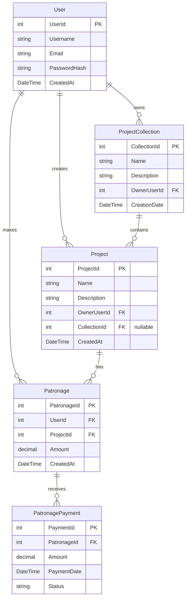

# Entity Relationship Diagram (ERD)

## Overview
This document provides a visual representation of the database structure and relationships between entities in the Peggy system.

## Diagram

## Entity Descriptions

### User
- Primary entity representing system users
- Can create multiple projects
- Can make multiple patronages
- Can own multiple project collections

### Project
- Represents creative projects in the system
- Belongs to a user (owner)
- Can optionally belong to a collection
- Can have multiple patronages

### Patronage
- Represents a user's patronage of a project
- Links a user to a project
- Can have multiple payments
- Tracks the total patronage amount

### PatronagePayment
- Represents individual payments made to a patronage
- Belongs to a single patronage
- Tracks payment amount and status
- Records payment date

### ProjectCollection
- Represents a collection of related projects
- Owned by a user
- Can contain multiple projects
- Has a name and description

## Relationships

1. **User to Project**
   - One-to-Many
   - A user can create multiple projects
   - Each project has one owner

2. **User to Patronage**
   - One-to-Many
   - A user can make multiple patronages
   - Each patronage is made by one user

3. **User to ProjectCollection**
   - One-to-Many
   - A user can own multiple collections
   - Each collection has one owner

4. **Project to Patronage**
   - One-to-Many
   - A project can have multiple patronages
   - Each patronage is for one project

5. **Patronage to PatronagePayment**
   - One-to-Many
   - A patronage can have multiple payments
   - Each payment belongs to one patronage

6. **ProjectCollection to Project**
   - One-to-Many
   - A collection can contain multiple projects
   - A project can belong to one collection (optional)

## Notes
- All entities include creation timestamps for auditing
- Foreign keys are properly indexed for performance
- Soft delete is implemented where appropriate
- All monetary values use decimal type for precision 